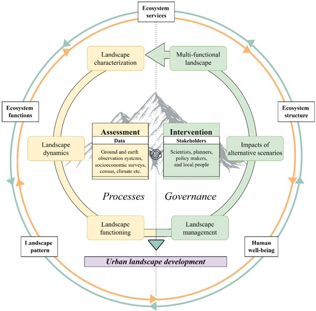

## The Problem With Mountain Planning

Mountain planning rarely fails for lack of ambition. It fails because
ecological evidence and governance decisions run in separate tracks
and never meet. This framework connects them — structured as two
interlocking steps, with the Himalayan landscape at the centre and sustainable
urban landscape development as the output.

---

## The Framework

{fig-alt="Circular 
framework diagram showing the two-step cycle of landscape assessment 
and governance intervention leading to urban landscape development 
in the Himalaya"}

The framework operates as two interlocking steps:
Assessment (understanding the system) and Intervention (shaping future outcomes).

Together, they produce a single output:
urban landscape development that is ecologically grounded and governance-ready.

---

## Step 1: Assessment — Understanding What the Landscape Is Doing

Assessment is about building a grounded understanding of how the landscape
has evolved and how it functions today — both structurally and ecologically.

**Landscape characterisation** Defines the functional 
extent of the landscape using ecological and socioeconomic 
boundaries, rather than administrative units. Multi-source 
datasets (remote sensing, field observations, institutional data) 
are integrated to produce a consistent, long-term LULC record.
This creates a spatiotemporal baseline for understanding landscape change.
See the [LULC Change project](lulc-himalaya.qmd).

*→ Defines what the landscape is, across space and time*

**Landscape dynamics** 
Analyses how the landscape is changing. Urban expansion is quantified (rate, intensity, spatial pattern), and linked directly with shifts in ecosystem service supply.

This is where urban growth and ecological function are analysed 
together, revealing how key ecosystem services are impacted in
response.
See the [Ecosystem Services
project](ecosystem-services.qmd)

*→ Explains how the landscape operates and evolves*

**Landscape evaluation** Assesses whether the landscape can 
continue to support urban growth. Hotspot–coldspot mapping of
 regulating ecosystem services identifies high-value 
ecological areas and zones most vulnerable to degradation. 
This step provides a spatial basis for 
conservation, restoration, and nature-based solutions (NBS).
See the [Ecosystem Services
project](ecosystem-services.qmd). 

*→ Identifies where development is viable—and where it is not*

---

## Step 2: Intervention — From Evidence to Action

Intervention translates landscape evidence into actionable planning strategies.

**Landscape management** Develops alternative development pathways
based on ecological capacity, planning needs, and stakeholder input
where possible. Climate change projections are integrated to ensure
plans remain realistic under future mountain conditions. See the
[Urban Growth Scenarios project](urban-growth-scenarios.qmd).

*→ Defines how the landscape could be transformed*

**Impacts of alternative scenarios** Quantifies what each pathway 
delivers. Ecosystem service supply is mapped across scenarios, 
making trade-offs between 
development and ecological function explicit and measurable.
This step turns abstract futures into comparable outcomes,
 enabling informed decision-making. It also identifies where 
targeted NBS can offset unavoidable impacts. 
See the [Ecosystem Services
project](ecosystem-services.qmd). 

*→ Reveals the consequences of each planning choice*

**Multi-functional landscape design** Integrates all 
findings into a balanced, decision-ready strategy. 
Development is aligned with ecological capacity—supporting 
growth where the system can absorb it, and protection where it cannot.

If needed, scenarios are iteratively refined 
until a workable balance is achieved.
*→ Delivers a spatial strategy ready for planning and policy integration*
---

## Three Projects. One Loop.

**[LULC Change](lulc-himalaya.qmd)** — the evidence base.
Twenty years of species-level land cover across Dharamshala and
Pithoragarh.

**[Ecosystem Services](ecosystem-services.qmd)** — the ecological
stakes. Flood regulation, carbon, soil erosion, and heat mitigation
mapped and hotspot-identified.

**[Urban Growth Scenarios](urban-growth-scenarios.qmd)** — the
futures. Three pathways to 2040 with quantified ecosystem
consequences for each.

No single project covers the full loop. Together they do.